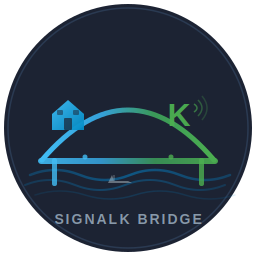

# SignalK Bridge for Home Assistant

<p align="center">
  
</p>

<p align="center">
  <a href="https://github.com/eburi/hass_signalk_bridge/actions/workflows/validate.yml"></a>
  <a href="https://github.com/eburi/hass_signalk_bridge/actions/workflows/lint.yml"></a>
  <a href="https://github.com/hacs/integration"></a>
  <a href="https://github.com/eburi/hass_signalk_bridge/releases"></a>
  <a href="LICENSE"></a>
</p>

A Home Assistant custom integration that connects to a [SignalK](https://signalk.org/) server over WebSocket and creates entities for your vessel's live data. It classifies incoming paths into functional domains and applies per-domain publish policies so that Home Assistant is never overwhelmed -- even on a Raspberry Pi.

## Why not just mirror every delta?

A SignalK server can emit dozens of updates per second. Writing each one directly into HA state causes recorder bloat, history graph noise, and sluggish UI on constrained hardware. SignalK Bridge sits a **publish-policy layer** between the delta stream and HA: it coalesces updates per domain, enforces minimum intervals and deadbands, and only writes state when something meaningful has changed or a heartbeat is due.

## Features

- **WebSocket push** -- real-time delta ingestion, no polling
- **4-layer path classifier** -- exact match, prefix rules, segment heuristics, fallback -- assigns every path to one of 14 functional domains
- **Per-domain publish policy** -- configurable `min_interval`, `max_interval`, and `deadband` per domain
- **3 publish profiles** -- Conservative (default), Balanced, Realtime -- switchable at runtime
- **Device tracker** -- vessel position rendered natively on the HA map
- **SI unit conversion** -- Kelvin to Celsius, radians to degrees, m/s to knots, Pa to hPa, ratio to %, and more
- **10 services** -- control SignalK values, tune policies, manage entities, inspect runtime state
- **Auto-discovery** -- new paths are classified and entities created automatically
- **New entities disabled by default** -- `enable_new_sensors_by_default` is `false` out of the box
- **SignalK add-on detection** -- finds the HA SignalK add-on automatically, or accepts any manual URL
- **Device Access auth** -- built-in SignalK device access request flow (no manual token copy)
- **Vessel self only** -- other vessels and AIS targets are ignored (architecture ready for future expansion)

## Installation

### HACS (recommended)

1. Open **HACS** in Home Assistant
2. Menu (top-right) > **Custom repositories**
3. Add `https://github.com/eburi/hass_signalk_bridge` as an **Integration**
4. Search for **SignalK Bridge**, click **Download**
5. Restart Home Assistant

[](https://my.home-assistant.io/redirect/hacs_repository/?owner=eburi&repository=hass_signalk_bridge&category=integration)

### Manual

1. Download `signalk_bridge.zip` from the [latest release](https://github.com/eburi/hass_signalk_bridge/releases)
2. Extract into `config/custom_components/signalk_bridge/`
3. Restart Home Assistant

## Setup

**Settings > Devices & Services > Add Integration > SignalK Bridge**

The config flow will:

1. Check for the SignalK HA add-on (e.g. `a0d7b954_signalk`) and offer to use it
2. Otherwise ask for the server URL (e.g. `http://192.168.1.100:3000`)
3. Test connectivity
4. Start the Device Access auth flow if needed -- approve the request in the SignalK admin UI
5. Ask for an entity prefix (default `signalk`)

### Options

After setup, go to **Settings > Devices & Services > SignalK Bridge > Configure** to change:

| Option | Default | Description |
|---|---|---|
| Base URL | auto-detected | SignalK server address |
| Entity prefix | `signalk` | Prefix for entity IDs (`sensor.signalk_speed_over_ground`) |
| Enable new sensors by default | off | Whether newly discovered entities start enabled |
| Publish profile | conservative | Throttling profile applied to all domains |
| Log ignored paths | off | Write ignored/unsupported paths to the HA log |
| Create diagnostic entities | on | Create connection-status and server-version sensors |

## Architecture

```
SignalK Server
    |
    v  WebSocket delta stream
+-------------------------------+
|  SignalK WebSocket Client     |  connect, authenticate, receive
+-------------------------------+
|  Canonical Path Mapper        |  strip vessels.self.*, drop .values.* / .meta.*
+-------------------------------+
|  4-Layer Classifier           |  exact -> prefix -> heuristic -> fallback
|  -> 14 functional domains     |
+-------------------------------+
|  Publish-Policy Engine        |  per-domain min_interval / max_interval / deadband
|  -> 3 profiles                |
+-------------------------------+
|  Entity Factory               |  sensor, device_tracker (dynamic creation)
+-------------------------------+
|  Home Assistant               |  state writes only when policy approves
+-------------------------------+
```

## Domains

Every canonical SignalK path is classified into one of these domains:

| Domain | Matches | Examples |
|---|---|---|
| **alarm** | `notifications.*` (non-AIS) | Anchor alarm, security alerts |
| **position** | `navigation.position`, `navigation.gnss.*` | GPS fix, HDOP, satellites |
| **navigation** | `navigation.speed*`, `navigation.heading*`, `navigation.course*` | SOG, COG, heading, log |
| **wind** | `environment.wind.*`, `performance.targetAngle`, `steering.autopilot.target.wind*` | AWS, AWA, TWS, TWD |
| **environment** | `environment.depth.*`, `environment.water.*`, `environment.inside.*`, `environment.current.*` | Depth, water temp, cabin humidity |
| **tank** | `tanks.*` | Fuel level, water tank, waste |
| **battery_dc** | `electrical.batteries.*`, `electrical.solar.*`, `electrical.alternators.*` | House voltage, solar current |
| **inverter_ac** | `electrical.inverters.*`, `electrical.ac.*`, `electrical.shorePower.*` | Shore power, generator AC |
| **engine_propulsion** | `propulsion.*` | RPM, oil pressure, coolant temp |
| **bilge_pump** | `bilge.*`, `pumps.*` | Pump state, run count |
| **watermaker** | `watermaker.*` | Production rate, hours |
| **communications** | `communication.*`, `noforeignland.*` | VHF callsign, tracking status |
| **time** | `navigation.datetime`, `*.estimatedTimeOfArrival`, `environment.sunlight.times.*` | ETA, sunrise, TTG |
| **status_metadata** | `name`, `mmsi`, `design.*`, `steering.autopilot.state`, `entertainment.*` | Vessel name, draft, autopilot mode |

Paths that don't match any rule are classified as `unsupported_ignore` and no entity is created.

## Publish profiles

Each profile defines `min_interval` / `max_interval` / `deadband` per domain. Switch profiles at runtime via the options UI or the `set_discovery_defaults` service.

| Domain | Conservative | Balanced | Realtime |
|---|---|---|---|
| alarm | immediate / 5 min | immediate / 5 min | immediate / 2 min |
| position | 10 s / 2 min, 25 m | 5 s / 1 min, 10 m | 2 s / 30 s, 5 m |
| navigation | 2 s / 1 min | 1 s / 30 s | 0.5 s / 15 s |
| wind | 2 s / 1 min | 1 s / 30 s | 0.5 s / 15 s |
| environment | 30 s / 5 min | 10 s / 2 min | 5 s / 1 min |
| tank | 60 s / 10 min | 30 s / 5 min | 15 s / 2 min |
| battery_dc | 30 s / 5 min | 10 s / 2 min | 5 s / 1 min |
| inverter_ac | 10 s / 2 min | 5 s / 1 min | 2 s / 30 s |
| engine_propulsion | 5 s / 2 min | 2 s / 1 min | 1 s / 30 s |
| bilge_pump | immediate / 5 min | immediate / 5 min | immediate / 2 min |
| watermaker | 30 s / 5 min | 10 s / 2 min | 5 s / 1 min |
| communications | 60 s / 10 min | 30 s / 5 min | 10 s / 2 min |
| time | 30 s / 5 min | 10 s / 2 min | 5 s / 1 min |
| status_metadata | 30 s / 10 min | 10 s / 5 min | 5 s / 2 min |

**How an update is published:**

1. First value for a path -- always published immediately
2. `min_interval` -- updates faster than this are coalesced
3. `deadband` -- numeric changes smaller than this are suppressed
4. `max_interval` -- a heartbeat refresh is forced even without change
5. Alarms and bilge pumps bypass throttling (immediate)

## Entities

Entities are created dynamically as SignalK paths arrive. New entities start **disabled** unless `enable_new_sensors_by_default` is turned on. Enable them individually in the entity registry or via the `enable_entities` service.

Example entities after connecting to a typical vessel:

| Entity | Type | Notes |
|---|---|---|
| `device_tracker.signalk_vessel_position` | device_tracker | Vessel on the map |
| `sensor.signalk_speed_over_ground` | sensor | SOG in knots |
| `sensor.signalk_course_over_ground_true` | sensor | COG in degrees |
| `sensor.signalk_depth_below_keel` | sensor | Depth in metres |
| `sensor.signalk_wind_speed_apparent` | sensor | Apparent wind in knots |
| `sensor.signalk_wind_angle_apparent` | sensor | AWA in degrees |
| `sensor.signalk_water_temperature` | sensor | Water temp in C |
| `sensor.signalk_batteries_house_voltage` | sensor | House bank voltage |
| `sensor.signalk_tanks_fuel_main_current_level` | sensor | Fuel level in % |
| `sensor.signalk_connection_status` | diagnostic | WebSocket state |
| `sensor.signalk_server_version` | diagnostic | Server version string |

All entities belong to a single HA device representing the vessel.

## Unit conversion

SignalK uses SI units exclusively. The integration converts automatically:

| SignalK | HA | Applies to |
|---|---|---|
| K | C | temperature |
| rad | degrees | heading, wind angle, COG |
| m/s | kn | SOG, STW, wind speed |
| Pa | hPa | atmospheric pressure |
| ratio (0-1) | % | tank level, battery SOC, humidity |
| J | Wh | energy |
| C (coulomb) | Ah | battery capacity |
| m | m | depth, distance (no conversion) |
| V, A, Hz, W | V, A, Hz, W | electrical (no conversion) |

## Services

All 10 services appear in **Developer Tools > Services** with full field selectors.

### signalk_bridge.put_value

Write a value to the SignalK server (HTTP PUT).

```yaml
service: signalk_bridge.put_value
data:
  path: electrical.switches.bank1.1.state
  value: 1
```

### signalk_bridge.post_delta

Send a delta update via WebSocket (falls back to REST).

```yaml
service: signalk_bridge.post_delta
data:
  path: steering.autopilot.target.headingMagnetic
  value: 3.14
```

### signalk_bridge.set_domain_policy

Override the publish policy for a domain at runtime.

```yaml
service: signalk_bridge.set_domain_policy
data:
  domain: navigation
  min_interval_seconds: 1.0
  max_interval_seconds: 10.0
  deadband: 0.01
```

### signalk_bridge.reset_domain_policy

Reset a domain back to the current profile defaults.

```yaml
service: signalk_bridge.reset_domain_policy
data:
  domain: navigation
```

### signalk_bridge.set_discovery_defaults

Change global settings at runtime without restarting.

```yaml
service: signalk_bridge.set_discovery_defaults
data:
  publish_profile: realtime
  enable_new_sensors_by_default: true
```

### signalk_bridge.rescan_paths

Re-discover paths from the in-memory cache and create any missing entities.

```yaml
service: signalk_bridge.rescan_paths
```

### signalk_bridge.reclassify_paths

Re-run the classifier on all known paths (useful after an integration update adds new rules).

```yaml
service: signalk_bridge.reclassify_paths
```

### signalk_bridge.enable_entities / disable_entities

Batch-enable or disable entities.

```yaml
service: signalk_bridge.enable_entities
data:
  entity_ids:
    - sensor.signalk_speed_over_ground
    - sensor.signalk_depth_below_keel
    - sensor.signalk_wind_speed_apparent
```

### signalk_bridge.dump_runtime_state

Write a full runtime snapshot to the HA log and fire a `signalk_bridge_runtime_state` event. Includes connection status, active profile, all domain policies, classified paths, ignored paths, and entity counts.

```yaml
service: signalk_bridge.dump_runtime_state
```

## Automation examples

### Switch profile based on speed

```yaml
automation:
  - alias: "Realtime profile when sailing"
    trigger:
      - platform: numeric_state
        entity_id: sensor.signalk_speed_over_ground
        above: 2
    action:
      - service: signalk_bridge.set_discovery_defaults
        data:
          publish_profile: realtime

  - alias: "Conservative profile when docked"
    trigger:
      - platform: numeric_state
        entity_id: sensor.signalk_speed_over_ground
        below: 0.5
        for: "00:10:00"
    action:
      - service: signalk_bridge.set_discovery_defaults
        data:
          publish_profile: conservative
```

### Anchor watch

```yaml
automation:
  - alias: "Anchor watch"
    trigger:
      - platform: state
        entity_id: device_tracker.signalk_vessel_position
    condition:
      - condition: zone
        entity_id: device_tracker.signalk_vessel_position
        zone: zone.anchorage
        state: false
    action:
      - service: notify.mobile_app
        data:
          title: Anchor Watch
          message: Vessel has left the anchorage zone
```

### Low battery alert

```yaml
automation:
  - alias: "Low house battery"
    trigger:
      - platform: numeric_state
        entity_id: sensor.signalk_batteries_house_voltage
        below: 12.0
    action:
      - service: notify.mobile_app
        data:
          title: Battery Warning
          message: >-
            House battery is {{ states('sensor.signalk_batteries_house_voltage') }} V
```

## Debugging

### Enable debug logging

```yaml
# configuration.yaml
logger:
  default: warning
  logs:
    custom_components.signalk_bridge: debug
```

### Inspect runtime state

Call `signalk_bridge.dump_runtime_state` from Developer Tools to see:

- Connection status and server info
- Active publish profile and per-domain policies
- All classified paths with their domains
- Ignored/unsupported paths
- Entity counts and latest values

### Log ignored paths

Turn on **Log Ignored Paths** in the options UI to see which incoming paths are being dropped and why.

## Requirements

- Home Assistant 2024.1+
- A [SignalK server](https://signalk.org/) (v1.x or v2.x) reachable over the network
- Python 3.11+ (ships with HA)

## Development

```bash
git clone https://github.com/eburi/hass_signalk_bridge.git
cd hass_signalk_bridge
python3 -m venv .venv
source .venv/bin/activate
pip install pytest pytest-asyncio ruff
pytest tests/ -v          # 335 tests, HA stubs (no full HA install needed)
ruff check .              # lint
ruff format --check .     # format verification
```

See [CONTRIBUTING.md](CONTRIBUTING.md) for more details.

## License

[MIT](LICENSE) -- Copyright (c) 2025 [@eburi](https://github.com/eburi)
